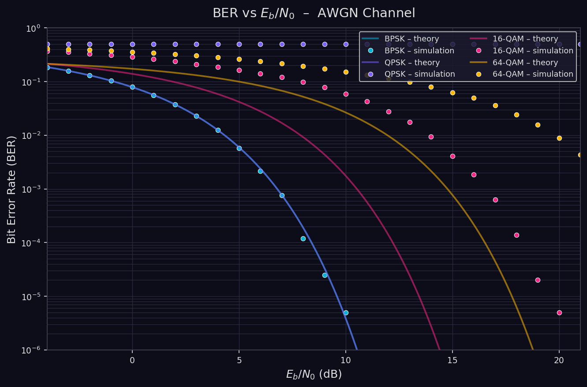
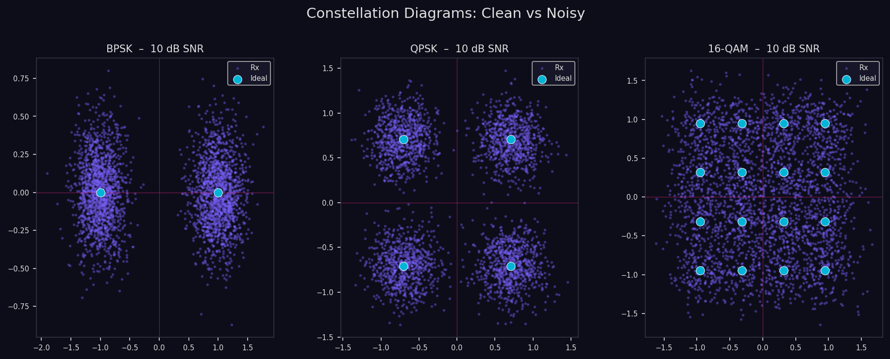
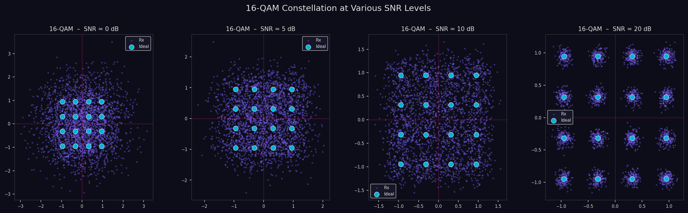

# Digital Communications Simulator

[](https://www.python.org/)
[](https://opensource.org/licenses/MIT)
[](https://github.com/your-username/digital-communications-simulator)
[](https://github.com/your-username/digital-communications-simulator)
[](https://github.com/your-username/digital-communications-simulator)

A complete Python simulator for digital baseband communications. Models the full transmit–receive chain — bit generation, modulation, channel noise, demodulation, and BER analysis — for **BPSK, QPSK, 16-QAM and 64-QAM** over **AWGN** and **Rayleigh fading** channels.

Designed as a clean, well-documented reference codebase for telecommunications engineering students and researchers.

---

## 📡 Overview

Modern wireless standards (LTE, 5G NR, Wi-Fi 6) rely on sophisticated modulation and coding to pack as many bits as possible into a limited radio spectrum while maintaining reliable delivery. This simulator reproduces the mathematical core of that process:

```
Bits → Mapper → s[n] → + n[n] → r[n] → Detector → Bits
                           ↑
                       AWGN / Rayleigh
```

Every block is implemented as a self-contained, importable Python module so you can swap components, add your own channel models, or extend the demodulators independently.

---

## 🔬 Key Features

- **Three modulation families** — BPSK, QPSK (Gray-coded), and square M-QAM (4 to 256, Gray-coded per axis)
- **Two channel models** — AWGN and flat Rayleigh fading with ideal zero-forcing equalisation
- **Theoretical BER curves** — closed-form Q-function expressions for all supported schemes
- **Monte-Carlo BER simulations** — empirical BER vs Eb/N0 sweeps validated against theory
- **Constellation diagrams** — clean vs noisy side-by-side, plus SNR sweep panels
- **Modular architecture** — every subsystem (modulation, channel, detection, metrics) lives in its own module
- **Zero external ML/DSP frameworks** — pure NumPy + SciPy + Matplotlib, easy to read and audit

---

## 🏗️ System Architecture

### Processing Pipeline

```
1. Bit Generation        generate_bits(N)
        │
2. Modulation            bpsk_mod / qpsk_mod / qam_mod
        │
3. Channel               awgn(signal, snr_db)
        │                rayleigh_channel(signal, snr_db)
        │
4. Demodulation          bpsk_demod / qpsk_demod / qam_demod
        │
5. BER Measurement       ber(tx_bits, rx_bits)
        │
6. Visualisation         BER curves · Constellation plots
```

### Repository Layout

```
digital-communications-simulator/
│
├── main.py                          # CLI entry point — runs all simulations
├── requirements.txt
├── .gitignore
│
├── src/
│   ├── __init__.py                  # Top-level API re-exports
│   ├── bits_generator.py            # Random bit sequence generator
│   │
│   ├── modulation/
│   │   ├── bpsk.py                  # Binary PSK mapper
│   │   ├── qpsk.py                  # Quadrature PSK (Gray-coded)
│   │   └── qam.py                   # Square M-QAM (Gray-coded per axis)
│   │
│   ├── channel/
│   │   ├── awgn.py                  # Additive White Gaussian Noise
│   │   └── rayleigh.py              # Flat Rayleigh fading + ZF equaliser
│   │
│   ├── demodulation/
│   │   ├── bpsk_demod.py            # Hard-decision BPSK detector
│   │   ├── qpsk_demod.py            # Hard-decision QPSK detector
│   │   └── qam_demod.py             # Minimum-distance M-QAM detector
│   │
│   ├── metrics/
│   │   └── ber.py                   # Empirical BER + theoretical curves
│   │
│   └── utils/
│       ├── constellation_plots.py   # Reusable Matplotlib constellation helpers
│       └── snr_tools.py             # SNR/Eb·N0 conversions, efficiency table
│
├── simulations/
│   ├── ber_vs_snr.py                # BER vs Eb/N0 Monte-Carlo sweep
│   └── constellation_examples.py   # Constellation panel generators
│
├── docs/
│   ├── theory.md                    # Modulation theory & channel models
│   └── equations.md                 # Quick-reference equation sheet
│
└── results/
    └── plots/                       # Generated figures (git-ignored)
```

---

## 📊 Results

### BER vs Eb/N0 — AWGN Channel

Simulated (dots) vs theoretical (lines) BER curves for all four schemes.  
BPSK and QPSK overlap exactly — identical BER when expressed as a function of Eb/N0.



### Constellation Diagrams — Clean vs Noisy (SNR = 10 dB)

Cyan dots mark the ideal constellation points; the violet cloud shows the received symbols after AWGN.



### 16-QAM Constellation at Various SNR Levels

The spread of the noise cloud grows visibly as SNR decreases, until decision regions start to overlap and errors occur.



---

## 📐 Technical Background

### Modulation Spectral Efficiency

| Scheme   | M    | bits / symbol | Relative BW | Robustness |
|----------|------|---------------|-------------|------------|
| BPSK     | 2    | 1             | 1×          | Very High  |
| QPSK     | 4    | 2             | ½           | High       |
| 8-PSK    | 8    | 3             | ⅓           | Medium     |
| 16-QAM   | 16   | 4             | ¼           | Medium-Low |
| 64-QAM   | 64   | 6             | ⅙           | Low        |
| 256-QAM  | 256  | 8             | ⅛           | Very Low   |

### BER Formulas

| Scheme       | Theoretical BER                                                                 |
|--------------|---------------------------------------------------------------------------------|
| BPSK         | `Q(√(2·Eb/N0))`                                                                 |
| QPSK         | `Q(√(2·Eb/N0))`                                                                 |
| M-QAM        | `(4/log₂M)·(1−1/√M)·Q(√(3·log₂M·Eb/N0 / (M−1)))`                              |

where `Q(x) = ½·erfc(x/√2)`.

Full derivations and the channel model equations are in [`docs/theory.md`](docs/theory.md).

---

## 🚀 Getting Started

### Prerequisites

- Python 3.10 or later
- `pip`

### Installation

```bash
git clone https://github.com/your-username/digital-communications-simulator.git
cd digital-communications-simulator
pip install -r requirements.txt
```

### Run all simulations

```bash
python main.py
```

Plots are saved to `results/plots/`.

### Run only one module

```bash
python main.py --only ber      # BER vs Eb/N0 curves only
python main.py --only const    # Constellation diagrams only
```

### Use the API directly

```python
from src import (
    generate_bits,
    qam_mod, awgn, qam_demod,
    ber, ber_qam_theory,
)
import numpy as np

N       = 100_000
bits    = generate_bits(N)
n       = (N // 4) * 4          # 16-QAM needs bits divisible by 4

tx      = qam_mod(bits[:n], M=16)
rx      = awgn(tx, snr_db=12.0)
rx_bits = qam_demod(rx, M=16)

print(f"Simulated BER : {ber(bits[:n], rx_bits):.4e}")
print(f"Theoretical   : {ber_qam_theory(np.array([12.0]), M=16)[0]:.4e}")
```

---

## 📜 License

This project is released under the **MIT License**.  
You are free to use, modify, and distribute it for any purpose, including commercial projects, as long as the original copyright notice is preserved.

See [`LICENSE`](LICENSE) for the full text.

---

## 📚 Documentation

| File | Contents |
|------|----------|
| [`docs/theory.md`](docs/theory.md) | AWGN model, modulation mappings, Q-function, Rayleigh fading |
| [`docs/equations.md`](docs/equations.md) | Quick-reference equation sheet |
| Inline docstrings | Every function is fully documented with parameter types and return shapes |

---

## 🤝 Contributing

Contributions are welcome. Suggested areas:

- **Turbo / LDPC coding** — add forward error correction to see coding gain on the BER curves
- **OFDM** — multicarrier extension with cyclic prefix and FFT-based modulation  
- **Soft-decision detection** — log-likelihood ratio demodulators for coded systems  
- **Streamlit dashboard** — interactive SNR slider, live BER and constellation update

Please open an issue before submitting a large pull request so we can align on scope.

---

## 📞 Contact

For bug reports or technical questions, [open a GitHub issue](https://github.com/your-username/digital-communications-simulator/issues).

---

**Star ⭐ this repository if it was useful for your studies or research!**

*Active project — feedback and pull requests are welcome.*
